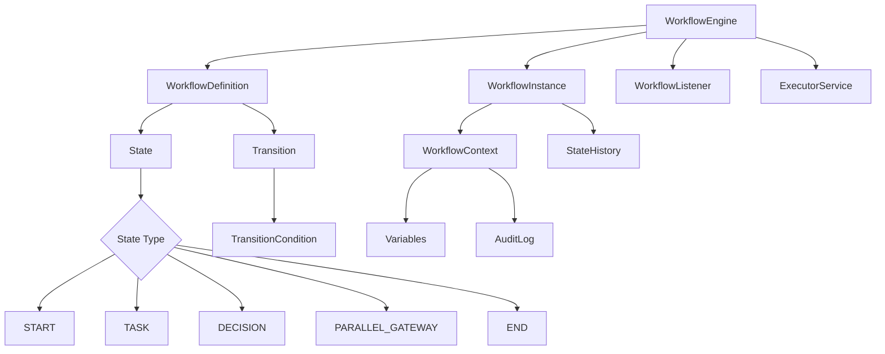

# Java Workflow Engine

[English](#english) | [Portugues](#portugues)

---

## Portugues

Motor de workflow empresarial em Java com maquina de estados, execucao condicional de transicoes, processamento paralelo e auditoria completa de processos de negocio.

### Arquitetura



### Funcionalidades

- Definicao de workflows com estados e transicoes condicionais
- Maquina de estados com tipos: START, TASK, DECISION, PARALLEL_GATEWAY, END
- Execucao assincrona com CompletableFuture e thread pool
- Contexto compartilhado com variaveis e log de auditoria
- Sistema de listeners para eventos do workflow
- Historico completo de transicoes de estado

### Tecnologias

| Tecnologia | Finalidade |
|---|---|
| Java 11+ | Linguagem principal |
| Maven | Gerenciamento de dependencias |
| ExecutorService | Execucao paralela |
| CompletableFuture | Processamento assincrono |

### Como Executar

```bash
mvn compile
mvn exec:java -Dexec.mainClass="com.galafis.workflow.WorkflowEngine"
```

### Estrutura do Projeto

```
Java-Workflow-Engine/
├── src/main/java/com/galafis/
│   └── workflow/
│       └── WorkflowEngine.java
├── pom.xml
├── LICENSE
└── README.md
```

---

## English

Enterprise workflow engine in Java featuring state machine execution, conditional transitions, parallel processing, and full business process auditing.

### Architecture


### Features

- Workflow definitions with states and conditional transitions
- State machine with types: START, TASK, DECISION, PARALLEL_GATEWAY, END
- Async execution with CompletableFuture and thread pool
- Shared context with variables and audit logging
- Listener system for workflow events
- Full state transition history

### Technologies

| Technology | Purpose |
|---|---|
| Java 11+ | Primary language |
| Maven | Dependency management |
| ExecutorService | Parallel execution |
| CompletableFuture | Async processing |

### How to Run

```bash
mvn compile
mvn exec:java -Dexec.mainClass="com.galafis.workflow.WorkflowEngine"
```

## Author

Gabriel Demetrios Lafis

## License

MIT License
